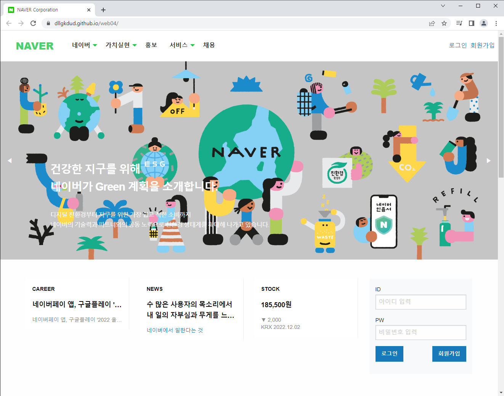
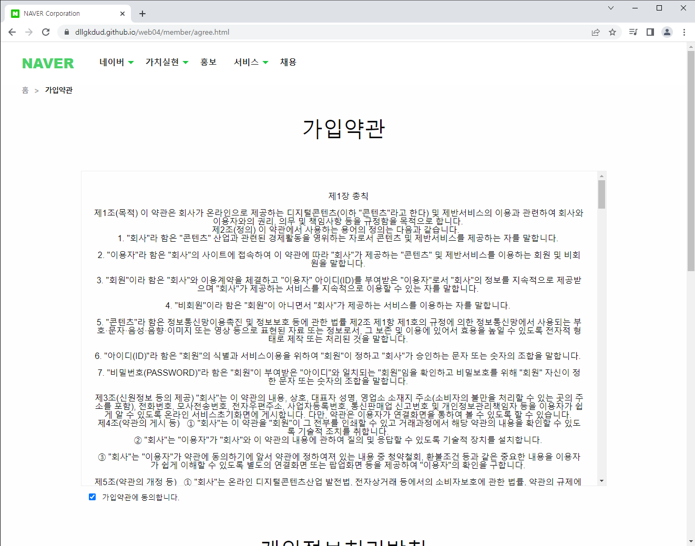
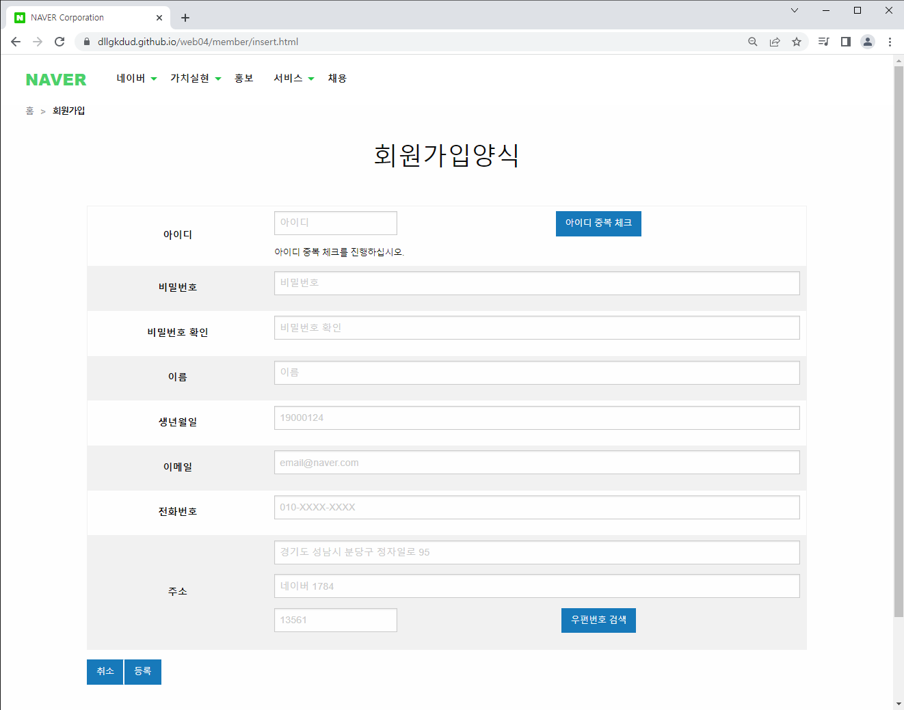

<h1 align='center'>&nbsp;Naver Corporation</h1> 

## 목차
 - [개요](https://github.com/dllgkdud/pro3#개요)
 - [사용자 인터페이스](https://github.com/dllgkdud/pro3#사용자-인터페이스)
 - [기술 환경](https://github.com/dllgkdud/pro3#기술-환경)
 - [시스템 구조](https://github.com/dllgkdud/pro3#시스템-구조)
 - [프로젝트 설계](https://github.com/dllgkdud/pro3#프로젝트-설계)
 - [핵심 기능](https://github.com/dllgkdud/pro3#핵심-기능)
 - [기능 구현](https://github.com/dllgkdud/pro3#기능-구현)

## 개요
포털사이트 점유율 약 69%를 차지하는 네이버의 코퍼레이션 기업형 웹 애플리케이션 사이트를 주제로 구현했습니다.  
✔담당자 : 이하영

## 사용자 인터페이스

사용자 인터페이스

* **메인 페이지**
  * `Ajax`로 작성된 `로그인`, `회원가입`, `메뉴`로 이동합니다.

  

* **홍보목록 페이지**
  * 작성된 `보도`를 확인하고 `상세` 페이지로 이동하거나 `작성` 페이지로 이동합니다.

  

* **보도상세 페이지**
  * `ckeditor.js`를 이용해 `등록`된 보도의 `상세정보`를 `확인`하며, `수정`, `삭제`를 진행합니다.

  
  
* **보도수정 페이지**
  * `ckeditor.js`를 이용해 `등록`된 보도의 `사진` 및 `내용`을 `수정`합니다.

  

## 기술 환경
 - Language(Front) : `Html5`, `CSS3`, `Javascript`, `JQuery`
 - Language(Back) : `Java`, `Jsp`
 - Editor : `Spring Tool Suite 3`
 - DBMS : `Oracle`
 - DBMS Model : `MVC Level 2`
 - Framework(front) : `Foundation`
 - Framework(back) : `Spring Legacy`
 - Security : `BCryptPasswordEncoder`
 - Target : `Web Browser`
 - Server : `Tomcat 9`
 - Infra : `EC2`, `RDS`
 - Etc : `Git`

## 시스템 구조

## 프로젝트 설계
### ERD

### 메뉴설계도

## 핵심 기능
### 회원
 - 아이디 중복
 - 비밀번호 확인
 - 회원정보
 - 회원정보 수정

### 홍보
 - 홍보 목록
 - 보도 상세
 - 보도 수정

### 공지사항
 - 공지 목록
 - 공지 상세(조회수 책정)

### 관리자
 - 회원 목록
 - 파일 업로드
 - 사진 파일명 랜덤 지정
 - 공지 등록/수정/삭제

## 기능 구현

사용자 기능 구현

* **메인 페이지**
  * `Ajax`로 작성된 `로그인`, `회원가입`, `메뉴`로 이동합니다.
  

* **회원가입 페이지**
  * `가입약관`의 `필수 선택` 후 `가입양식` 페이지로 이동한다.
  
  
  ")
  ")

* **홍보 페이지**
  * `가입약관`의 `필수 선택` 후 `가입양식` 페이지로 이동한다.
  

## UI TEST

계획서/보고서_다운로드

  ![[pro4]UI TEST 계획서.pdf](https://github.com/dllgkdud/pro4/files/10420663/pro4.UI.TEST.pdf "계획서_다운로드")
  ![[pro4]UI TEST 결과보고서.pdf](https://github.com/dllgkdud/pro4/files/10420665/pro4.UI.TEST.pdf "보고서_다운로드")

